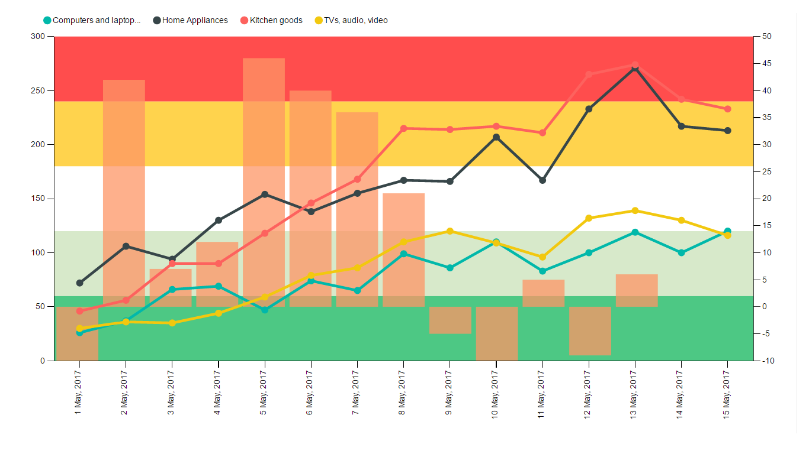

# PKPI Chart by Akvelon
KPI Chart by Akvelon

# Overview

KPI Chart by Akvelon is a single visualization for illustrating and efficiently analyzing the correlation between two measures and it combines a line

chart and a column chart with the same X axis. Column and line charts show representation of the distribution of numerical data. Additionally,

KPI Chart by Akvelon allows to show static and dynamic background KPI regions that can characterize, for example, the

level of success before reaching the target. This chart is simplified version of Line and Clustered column chart with the ability to create multiple lines and

add horizontal regions to assess progress.  

 

The KPI Chart by Akvelon has a flexible structure, changes the size and shape of the represented area and adjusts the distance to the border 

of the chart, depending on the user's settings.
